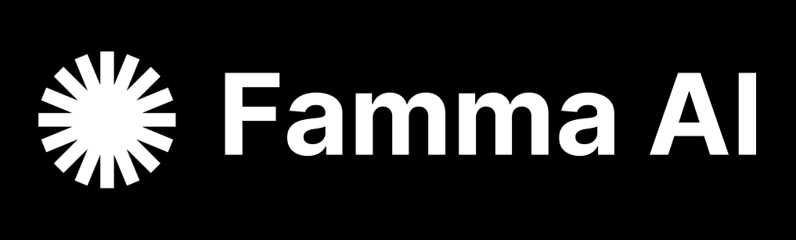

<p align="center">
  <picture>
    <source media="(prefers-color-scheme: light)" srcset=".github/images/white-preference.png">
    <source media="(prefers-color-scheme: dark)" srcset=".github/images/dark-preference.png">
    
  </picture>
</p>

<p align="center">
  <a href="https://famma.ai" target="_blank">
          </a>
  <a href="https://twitter.com/intent/follow?screen_name=Famma_AI" target="_blank">
          </a>
  <a href="https://www.linkedin.com/company/109541898/" target="_blank">
          </a>
  <a href="https://www.npmjs.com/package/@famma/mcp-auth" target="_blank">
           </a>
  <a href="https://github.com/famma-ai/mcp-auth/blob/main/LICENSE" target="_blank">
          </a>
</p>

# Famma AI - MCP Auth

SDK for building OAuth-protected Remote MCP servers on Cloudflare Workers with pluggable auth adapters (Supabase already implemented).

## Who is this for?

TL;DR: If you are building an MCP server/agent that needs user authentication but your identity provider does not yet offer an OAuth 2.1 flow (e.g., Supabase as of October 2025), this SDK helps you run your MCP behind a reverse-proxy-based OAuth flow and deploy it as a Cloudflare Worker.
Use this if:
- You have an MCP agent/server and need authenticated access per user.
- Your IdP lacks a suitable OAuth 2.1 flow for your use case today.
- You want a Cloudflare Workers deployment with pluggable auth adapters (Supabase included).

## Interface
- Exported primitives: `createOAuthProviderWithMCP`, `createAuthProxy`
- Adapters: `SupabaseAuthAdapter`
- Types: `AppConfig`, `AuthAdapter`, `CoreBindings`, `TokenExchangeResult`
  - `AppConfig.loginPath?` optional login route (default `"/auth/login"`)

## Install

```bash
npm install @famma/mcp-auth
```

## Quickstart

Your MCP agent should be of type `agents/mcp` (extend or be compatible with `McpAgent`).

```ts
// src/worker.ts
import { createOAuthProviderWithMCP, SupabaseAuthAdapter, type AppConfig } from "@famma/mcp-auth";
import { McpAgent } from "agents/mcp";
import { McpServer } from "@modelcontextprotocol/sdk/server/mcp.js";

class MyMCP extends McpAgent {
  server = new McpServer({ name: "Demo", version: "1.0.0" });
  async init() {
    this.server.tool("whoami", async () => ({
      content: [{ type: "text", text: String(this.props?.userEmail ?? "Unknown user") }],
    }));
  }
}

let provider: ReturnType<typeof createOAuthProviderWithMCP> | undefined;

export default {
  async fetch(request: Request, env: any, ctx: ExecutionContext) {
    if (!provider) {
      const appConfig: AppConfig = {
        logoUrl: env.LOGO_URL ?? "https://example.com/logo.png",
        companyName: env.COMPANY_NAME ?? "Example Co",
        proxyTargetUrl: env.PROXY_TARGET_URL,
        // Optional: customize the login route mounted by the proxy (default "/auth/login")
        loginPath: env.LOGIN_PATH ?? "/auth/login",
      };

      const authAdapter = new SupabaseAuthAdapter({
        supabaseUrl: env.SUPABASE_URL,
        supabaseAnonKey: env.SUPABASE_ANON_KEY,
      });

      provider = createOAuthProviderWithMCP({
        mcpAgentClass: MyMCP,
        authAdapter,
        appConfig,
      });
    }
    return provider.fetch(request, env, ctx);
  },
};
```

## Setup and Deployment

### 1. Create KV namespace

First, create a KV namespace for token storage:

```bash
npx wrangler kv namespace create OAUTH_KV
```

Copy the `id` value from the output.

### 2. Configure wrangler.jsonc

Create or update your `wrangler.jsonc` with the KV ID from the previous step. Make sure to keep the `binding` name as `OAUTH_KV`:

```json
{
  "name": "mcp-worker",
  "main": "src/worker.ts",
  "compatibility_date": "2025-03-10",
  "compatibility_flags": ["nodejs_compat"],
  "kv_namespaces": [
    { "binding": "OAUTH_KV", "id": "<your-kv-id>" }
  ],
  "vars": {
    "COMPANY_NAME": "Example Co",
    "LOGO_URL": "https://example.com/logo.png",
    "PROXY_TARGET_URL": "https://your-login-host.example.com"
  }
}
```

### 3. Create .dev.vars for local development

For local development, create a `.dev.vars` file in your project root:

```bash
# .dev.vars (for local development only - DO NOT commit to git)
SUPABASE_URL=https://your-project.supabase.co
SUPABASE_ANON_KEY=your-anon-key-here
PROXY_TARGET_URL=http://localhost:3000
```

**Note**: `.dev.vars` is already included in `.gitignore` to prevent accidental commits of sensitive credentials.

### 4. Set secrets for production

For production deployment, configure all environment variables as secrets with Wrangler:

```bash
# Required secrets
npx wrangler secret put SUPABASE_URL
npx wrangler secret put SUPABASE_ANON_KEY
npx wrangler secret put PROXY_TARGET_URL
```

### 5. Run locally or deploy

```bash
# Local development (uses .dev.vars)
npx wrangler dev

# Deploy to production (uses wrangler secrets)
npx wrangler deploy
```

Use `npx @modelcontextprotocol/inspector` or `npx @mcpjam/inspector@latest` to connect and test your MCP server.

## Example Project

See `examples/supabase/` for a complete working Worker with:
- Example MCP agent
- Your Supabase Auth provider
- Runtime adapter construction from `env`
- Dev vars template and Wrangler config

## Building a Custom Auth Provider (non-Supabase)

Implement the `AuthAdapter` interface and pass your adapter to `createOAuthProviderWithMCP`.

Key responsibilities:
- `getUser(c)`: return `{ id, email }` when authenticated, or `null`.
- `getSession(c)`: return `{ accessToken, refreshToken, ... }` or `null`.
- `getAuthorizationProps(c, user, session)`: return properties to persist with the OAuth token. Include anything required for future refreshes (e.g., API base URL, client id/secret, tenant).
- `tokenExchangeCallback({ grantType, props })` (optional): perform refresh flow and return updated tokens.

Minimal skeleton:

```ts
import type { Context } from 'hono';
import type {
  AuthAdapter,
  AuthUser,
  AuthSession,
  CoreBindings,
  TokenExchangeResult,
} from '@famma/mcp-auth';

export interface MyBindings extends CoreBindings {
  // Add any additional env bindings if your provider needs them
}

export class HeaderAuthAdapter implements AuthAdapter<MyBindings> {
  async getUser(c: Context<{ Bindings: MyBindings }>): Promise<AuthUser | null> {
    // Example: derive user from headers/cookies/session
    const userId = c.req.header('x-user-id');
    const userEmail = c.req.header('x-user-email');
    if (!userId) return null;
    return { id: userId, email: userEmail ?? null };
  }

  async getSession(c: Context<{ Bindings: MyBindings }>): Promise<AuthSession | null> {
    // Example: access token from header/cookie; refresh token optional
    const accessToken = c.req.header('x-access-token');
    const refreshToken = c.req.header('x-refresh-token') ?? '';
    if (!accessToken) return null;
    return { accessToken, refreshToken };
  }

  async getAuthorizationProps(
    _c: Context<{ Bindings: MyBindings }>,
    user: AuthUser,
    session: AuthSession,
  ): Promise<Record<string, any>> {
    return {
      userEmail: user.email ?? '',
      userId: user.id,
      accessToken: session.accessToken,
      refreshToken: session.refreshToken,
      // Add provider-specific props needed for future refresh
      providerBaseUrl: 'https://api.example.com',
      clientId: 'your-client-id',
    };
  }

  // Optional: implement refresh flow
  async tokenExchangeCallback({ grantType, props }: { grantType: string; props: Record<string, any> }): Promise<TokenExchangeResult | void> {
    if (grantType !== 'refresh_token') return;
    const rt = props?.refreshToken as string | undefined;
    if (!rt) return;
    // Perform your provider's refresh request here
    // const resp = await fetch('https://api.example.com/oauth/token', { ... });
    // const json = await resp.json();
    const newAccess = 'NEW_ACCESS_TOKEN';
    const newRefresh = rt; // or a rotated token
    return {
      accessTokenProps: { ...props, accessToken: newAccess },
      newProps: { ...props, accessToken: newAccess, refreshToken: newRefresh },
      // accessTokenTTL: json.expires_in,
    };
  }
}
```

Wire it into a Worker:

```ts
import { createOAuthProviderWithMCP, type AppConfig } from '@famma/mcp-auth';
import { McpAgent } from 'agents/mcp';
import { HeaderAuthAdapter } from './header-auth-adapter';

class MyMCP extends McpAgent { /* ...tools... */ }

export default {
  async fetch(request: Request, env: any, ctx: ExecutionContext) {
    const appConfig: AppConfig = {
      logoUrl: env.LOGO_URL,
      companyName: env.COMPANY_NAME,
      proxyTargetUrl: env.PROXY_TARGET_URL,
      // Optional: customize login route (default "/auth/login")
      loginPath: env.LOGIN_PATH ?? "/auth/login",
    };
    const authAdapter = new HeaderAuthAdapter();
    return createOAuthProviderWithMCP({
      mcpAgentClass: MyMCP,
      authAdapter,
      appConfig,
    }).fetch(request, env, ctx);
  }
}
```

A full runnable sample is in `examples/custom-adapter/`.

## API

```ts
import {
  createOAuthProviderWithMCP,
  createAuthProxy,
  SupabaseAuthAdapter,
  type SupabaseAdapterConfig,
  type SupabaseBindings,
  type AppConfig,
  type AuthAdapter,
  type CoreBindings,
  type TokenExchangeResult,
} from "@famma/mcp-auth";
```

- `createOAuthProviderWithMCP({ mcpAgentClass, authAdapter, appConfig, tokenExchangeCallback? })`
  - Returns an `OAuthProvider` Worker-compatible handler. Uses `authAdapter.tokenExchangeCallback` by default.
- `createAuthProxy(authAdapter, appConfig)`
  - Returns a Hono app implementing `/authorize`, `/approve`, `loginPath` (default `"/auth/login"`), and a reverse proxy.
- `SupabaseAuthAdapter(config: SupabaseAdapterConfig)`
  - Requires: `supabaseUrl`, `supabaseAnonKey`.

### AuthAdapter contract

```ts
interface AuthAdapter<TBindings = any> {
  getUser(c): Promise<AuthUser | null>;
  getSession(c): Promise<AuthSession | null>;
  getAuthorizationProps(c, user, session): Promise<Record<string, any>>;
  tokenExchangeCallback?: (args: { grantType: string; props: Record<string, any> }) => Promise<TokenExchangeResult | void>;
}
```

The Supabase adapter implements `tokenExchangeCallback` to rotate `refresh_token` via Supabase.

## Notes
- Cloudflare Workers do not use `process.env`; read runtime config from `env` in `fetch`.
- The OAuth provider requires `OAUTH_KV` configured in Wrangler.

## Compatibility and requirements

- Cloudflare Workers: compatibility_date `2025-03-10` or newer
- Wrangler: v4.42+ (with `nodejs_compat` flag enabled)
- KV: `OAUTH_KV` namespace required for token storage
- Node.js: 18+ for local development/build tooling
- TypeScript: 5.9+

Note: Environment variables are optional in examples; you may hardcode values or use `vars`/secrets in Wrangler for production.

## Contributing

Requirements: Node 18+, npm, Wrangler.

Development:

```bash
npm install
npm run build

# Example worker (dev)
cd examples/supabase
npx wrangler dev

# Formatting / lint
npm run format
npm run lint:fix
```

Please open issues or PRs on GitHub.

## Links

Repo: https://github.com/famma-ai/mcp-auth

- MCP: https://modelcontextprotocol.io
- Cloudflare Workers OAuth provider: https://developers.cloudflare.com/workers/
- npm: https://www.npmjs.com/package/@famma/mcp-auth

## Credits

Built on top of [Josh Warwick's comprehensive guide on building Remote MCP servers](https://blog.remote-mcp.com/p/from-hackathon-to-revenue-how-i-built), this SDK extends his work into a reusable, pluggable adapter architecture.

## License

MIT © 2025 Famma. See `LICENSE` for details.
